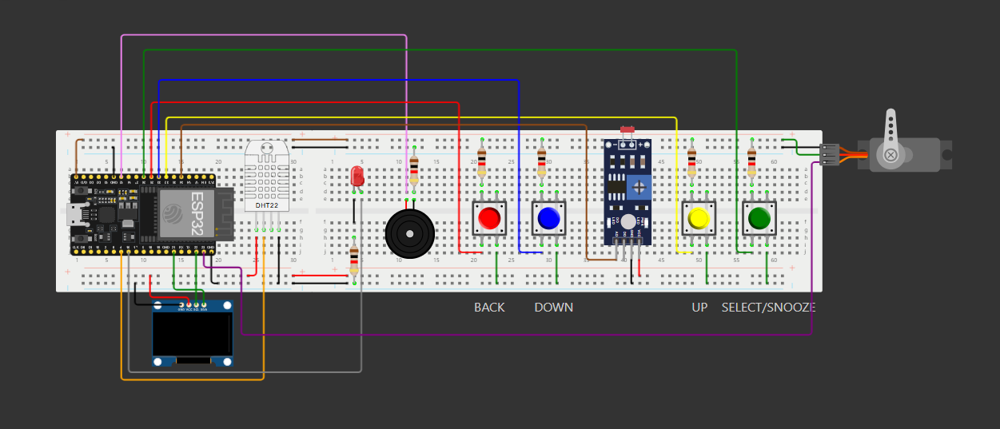
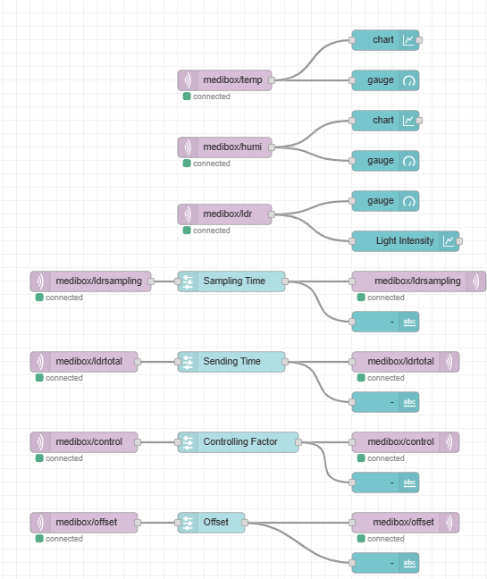

# MediBox

ESP32‑based **smart medication reminder and environmental monitor** that combines local OLED UI with cloud connectivity. MediBox dispenses pills on schedule, sounds alarms, and streams sensor data to an MQTT broker so you can supervise it from a Node‑RED dashboard or any MQTT client.

---

## Features ✨

* **Dual configurable alarms** plus snooze
* **Servo‑driven pill drawer** with adaptive positioning
* Real‑time clock via NTP with adjustable GMT offset
* **Temperature & humidity guard** (DHT22) – buzzer warns of unsafe ranges
* **Ambient‑light feedback** (LDR) regulates servo opening
* 128 × 64 OLED menu and data display
* Publishes sensor readings and accepts remote commands over **MQTT**
* Ready to simulate on **Wokwi** and monitor/control with **Node‑RED**

---

## Hardware Bill of Materials

| # | Component                                 | Typical Part No.       | Notes        |
| - | ----------------------------------------- | ---------------------- | ------------ |
| 1 | ESP32 DevKit v1                           | ‑                      | Wi‑Fi/BT MCU |
| 2 | SSD1306 0.96” OLED, I²C                   | 128×64                 | 3.3 V        |
| 3 | DHT22 (AM2302)                            | Temperature + Humidity |              |
| 4 | Light‑dependent resistor + 10 kΩ          | LDR sensor             |              |
| 5 | SG90 micro‑servo                          | GPIO 23, 5 V supply    |              |
| 6 | Active buzzer                             | GPIO 12                |              |
| 7 | Momentary push buttons ×4                 | GPIO 25,26,32,33       |              |
| 8 | Misc. resistors, dupont wires, breadboard |                        |              |

---

## Pinout & Wiring Overview

```
ESP32        Peripheral
-----        ----------
GPIO 21 ---- OLED SDA
GPIO 22 ---- OLED SCL
GPIO 4  ---- DHT22 DATA
GPIO 34 ---- LDR analog (via divider)
GPIO 23 ---- Servo signal
GPIO 12 ---- Buzzer +
GPIO 25 ---- BTN “OK/Select” (active‑low w/ INPUT_PULLUP)
GPIO 26 ---- BTN “Back/Cancel”
GPIO 32 ---- BTN “Next ↓”
GPIO 33 ---- BTN “Prev ↑”
3V3   ------ OLED VCC, DHT22 VCC
5V    ------ Servo VCC, Buzzer VCC
GND   ------ Common ground
```


> **Tip:** Use a dedicated 5 V rail for the servo to avoid brown‑outs.

---

## Software Dependencies

Install these libraries through the Arduino Library Manager (or PlatformIO):

* **Adafruit GFX**
* **Adafruit SSD1306**
* **DHT sensor library**
* **PubSubClient**
* **ESP32Servo**

---

## MQTT Topics

| Topic                 | Direction   | Payload       | Purpose                |
| --------------------- | ----------- | ------------- | ---------------------- |
| `medibox/temp`        | ⇢ publish   | `float` (°C)  | Current temperature    |
| `medibox/humi`        | ⇢ publish   | `float` (%)   | Current humidity       |
| `medibox/ldr`         | ⇢ publish   | `float` (0–1) | Normalised light level |
| `medibox/ldrsampling` | ⇠ subscribe | `int` s       | LDR sample period      |
| `medibox/ldrtotal`    | ⇠ subscribe | `int` s       | LDR running‑avg window |
| `medibox/basetemp`    | ⇠ subscribe | `float` °C    | Ideal room temperature |
| `medibox/offset`      | ⇠ subscribe | `float` °     | Servo base offset      |
| `medibox/control`     | ⇠ subscribe | `float`       | Servo control factor   |
| `medibox/buzzer`      | ⇠ subscribe | `on/off`      | Force buzzer state     |

*Default broker in sketch:* `broker.hivemq.com:1883` (change `MQTT_BROKER` if needed).


---

## Node‑RED Dashboard

A ready‑made flow `medibox_dashboard.json` exposes sliders for LDR timing, servo factors, and real‑time charts. Import via **Menu ▸ Import ▸ Clipboard**, update broker credentials, and deploy.


---
